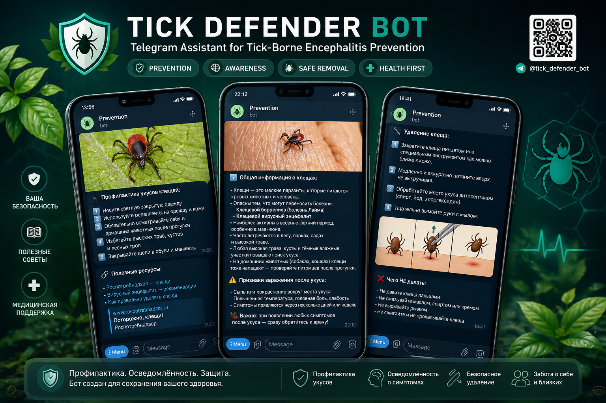

<div align="center">


</div>

---

<div align="center">

[]()
[]()
[]()

</div>

---

## 🧠 Project Overview

**Tick Defender Bot** is an educational Telegram assistant designed to increase public awareness of tick-borne encephalitis and improve preventive behavior during outdoor activities.

The bot provides:
- preventive recommendations before visiting forests and parks
- detailed instructions for safe tick removal
- symptom awareness information
- official epidemiological guidance

Its primary mission is to make reliable medical prevention information accessible in a simple conversational format.

---

## ⚕ Functional Modules

| Module | Description |
|--------|-------------|
| 🛡 Prevention Guide | Clothing, repellents, vaccination, behavior in endemic zones |
| 🕷 Tick Removal | Several safe extraction methods with explanations |
| 🚨 Symptom Alert | Information about dangerous post-bite symptoms |
| 📚 Official Sources | Recommendations based on public health guidelines |

---

## 📱 Bot Interface Showcase

<div align="center">
  
</div>

---

## 🔄 User Workflow

```txt
User starts bot
     ↓
Chooses prevention / tick removal / symptoms
     ↓
Receives medical instructions in Telegram chat
     ↓
Gets official recommendations for further actions
```

---

## ⚙ Technology Stack

<div align="center">

</div>

- Python Telegram Bot API
- Structured medical information blocks
- Educational public health logic

---

## 🎯 Practical Significance

Tick-borne encephalitis remains a significant epidemiological concern in many endemic regions.

This bot transforms fragmented preventive information into a fast and user-friendly mobile consultation format, helping users react correctly in high-risk situations.

---

## 🚀 Future Improvements

- AI-powered symptom assessment
- geolocation endemic zone alerts
- vaccination reminder system
- integration with regional healthcare resources

---

<div align="center">

### 💬 Educational Telegram Bot for Public Health Prevention

</div>
