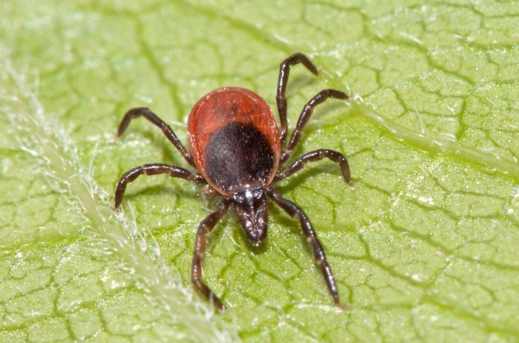

# 🛡️ Клещ-Защитник | Telegram-бот

Бот, который помогает предотвратить укусы клещей и спокойно разобраться, что делать, если укус всё-таки случился 🤔



## ✨ Что умеет бот

- 🛡️ **Профилактика укусов** — как правильно одеваться и вести себя на природе
- ⚠️ **Действия при укусе** — 4 безопасных способа удалить клеща + важные советы
- ℹ️ **Общая информация** — какие болезни переносят клещи и на что обращать внимание
- 🔗 **Полезные ссылки** — официальные рекомендации Роспотребнадзора

## 🚀 Как быстро запустить бота

### 1. Скачай проект
```bash
git clone https://github.com/ExperienceIV/Telegram-bot-for-the-prevention-of-tick-borne-encephalitis.git
cd Telegram-bot-for-the-prevention-of-tick-borne-encephalitis
```

### 2. Установи библиотеки
```bash
pip install -r requirements.txt
```

### 3. Добавь свой токен
```bash
cp .env.example .env
```
Открой файл `.env` и вставь туда свой настоящий токен бота.

### 4. Запусти бота
```bash
python bot.py
```

Готово! Бот должен написать «🚀 Бот запущен!» ✨

## 📁 Что лежит в папке

- `bot.py` — главный файл бота
- `requirements.txt` — нужные библиотеки
- `.env.example` — пример токена
- `images/` — папка с картинками для ответов
- `README.md` — этот файл :)

## 🖼️ Важно про картинки

Убедись, что в папке `images/` лежат файлы **точно** с такими именами:
- `prevention.jpg`
- `after_bite.png`
- `info.jpeg`

Если названия отличаются — бот не сможет показать фотографии.

---

Бот открыт к улучшениям!

Буду рад любым предложениям, идеям и пулл-реквестам.  
Можешь улучшать тексты, добавлять новые функции или просто писать, что можно сделать лучше. ✨